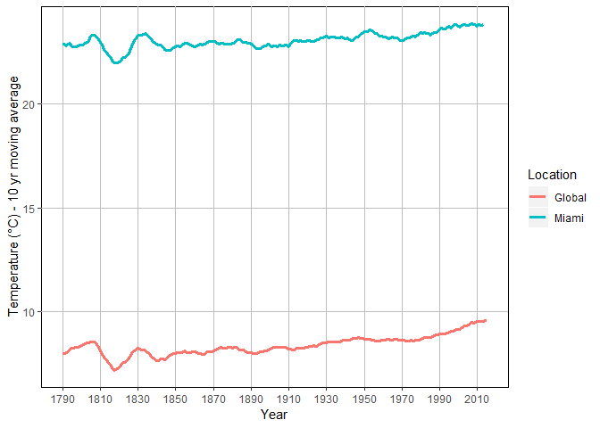
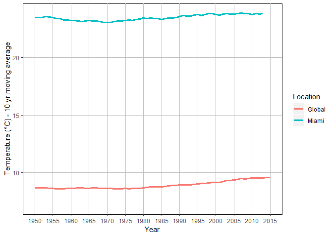

Udacity DAND: Weather Trends
================
Liz Herdter Smith

Introduction
============

We have been asked to explore weather trends for our closest city and compare them to global averages. My closest city is Miami. Below, I will detail data procurrement, general methodology and a summary of findings.

Methods
=======

1.  Query the SQL database for global averages and Miami averages. Export CSV. I used two queries to do so:

To otain global data:
SELECT \*
FROM global\_data

To obtain Miami data:
SELECT \*
FROM city\_data
WHERE city = 'Miami'

1.  Explore the CSV and produce a moving average. I used R for my analyses. My workflow for loading packages, reading in data, wrangling data, and producing a moving average are detailed below.

2.  Visualize the data in a line chart. I used `ggplot` to visualize the data. The workflow to do so is outlined below.

Load libraries and data
-----------------------

Install **tidyquant** if you don't have it already. **tidyquant** includes tidyverse, lubridate, and zoo; packages that are useful for timeseries analysis.

``` r
install.packages('tidyquant')
```

I prefer to work with CSV files. I have renamed them to be more descriptive of their contents.

``` r
library(tidyquant)
world <- read_csv('RawData/world_avg.csv')
miami <- read_csv('RawData/miami_avg.csv')
```

Explore data
------------

What do they look like?

``` r
head(world)
```

    ## # A tibble: 6 x 2
    ##    year avg_temp
    ##   <int>    <dbl>
    ## 1  1750     8.72
    ## 2  1751     7.98
    ## 3  1752     5.78
    ## 4  1753     8.39
    ## 5  1754     8.47
    ## 6  1755     8.36

``` r
tail(world)
```

    ## # A tibble: 6 x 2
    ##    year avg_temp
    ##   <int>    <dbl>
    ## 1  2010     9.70
    ## 2  2011     9.52
    ## 3  2012     9.51
    ## 4  2013     9.61
    ## 5  2014     9.57
    ## 6  2015     9.83

``` r
head(miami)
```

    ## # A tibble: 6 x 4
    ##    year city  country       avg_temp
    ##   <int> <chr> <chr>            <dbl>
    ## 1  1758 Miami United States     23.0
    ## 2  1759 Miami United States     22.6
    ## 3  1760 Miami United States     15.1
    ## 4  1761 Miami United States     NA  
    ## 5  1762 Miami United States     NA  
    ## 6  1763 Miami United States     NA

``` r
tail(miami)
```

    ## # A tibble: 6 x 4
    ##    year city  country       avg_temp
    ##   <int> <chr> <chr>            <dbl>
    ## 1  2008 Miami United States     23.8
    ## 2  2009 Miami United States     23.9
    ## 3  2010 Miami United States     22.8
    ## 4  2011 Miami United States     24.2
    ## 5  2012 Miami United States     23.9
    ## 6  2013 Miami United States     24.4

Looks like some missing values exist... are there any more?

``` r
world %>% arrange(desc(is.na(avg_temp)))
```

    ## # A tibble: 266 x 2
    ##     year avg_temp
    ##    <int>    <dbl>
    ##  1  1750     8.72
    ##  2  1751     7.98
    ##  3  1752     5.78
    ##  4  1753     8.39
    ##  5  1754     8.47
    ##  6  1755     8.36
    ##  7  1756     8.85
    ##  8  1757     9.02
    ##  9  1758     6.74
    ## 10  1759     7.99
    ## # ... with 256 more rows

``` r
miami %>% arrange(desc(is.na(avg_temp)))
```

    ## # A tibble: 256 x 4
    ##     year city  country       avg_temp
    ##    <int> <chr> <chr>            <dbl>
    ##  1  1761 Miami United States       NA
    ##  2  1762 Miami United States       NA
    ##  3  1763 Miami United States       NA
    ##  4  1764 Miami United States       NA
    ##  5  1765 Miami United States       NA
    ##  6  1766 Miami United States       NA
    ##  7  1767 Miami United States       NA
    ##  8  1772 Miami United States       NA
    ##  9  1774 Miami United States       NA
    ## 10  1778 Miami United States       NA
    ## # ... with 246 more rows

There are no missing values in the `world` dataset but there are some missing values in the `miami` data set up to 1780 so it would be best to remove those years from BOTH datasets so the moving averages are calculated over the same years.

Wrangle Data
------------

1.  Trim data.
2.  Produce moving average.
3.  Get into appropriate format for `ggplot`.

### Trim data

Filter dataset to remove NA values, as described above.

``` r
world <- world %>% filter(year>1780)
miami <- miami %>% filter(year>1780)
```

### Produce moving average

Use `tq_mutate` in **tidyquant** to produce a moving average. A caveat of this function is that the data MUST have a date object, not just integers of YYYY format.
So, first convert year to a character, then to a year format.

``` r
world <- world %>% mutate(year = as.character(year)) %>% mutate(year = as.Date(year, "%Y"))
```

Then apply `tq_mutate` to produce moving average.

``` r
world <- world %>% tq_mutate(avg_temp, mutate_fun=rollapply, width=10, FUN= mean, align='right', col_rename= 'MA_10')
```

Finally, convert year back to integer type.

``` r
world <- world  %>% mutate(year= year(year))
```

Now do the same thing for the `miami` dataset.

``` r
miami <- miami %>% mutate(year = as.character(year)) %>% mutate(year = as.Date(year, "%Y")) %>% tq_mutate(avg_temp, mutate_fun=rollapply, width=10, FUN= mean, align='right', col_rename= 'MA_10')%>% mutate(year= year(year))
```

### Turn into tidy format for plotting

``` r
miami <- miami %>% select(year, avg_temp, MA_10, city) %>% rename(Location = city) 
world <- world %>% select(year, avg_temp, MA_10) %>% mutate(Location="Global")
all <- rbind(miami, world)
```

Visualize data
--------------

``` r
ylab <- "Temperature (°C) - 10 yr moving average"

ggplot(all, aes(x=year, y=MA_10, color=Location)) +geom_line(size=1.2) +  
  ylab(ylab)+
  xlab("Year")+
  scale_x_continuous(limits=c(1790,2015), breaks=seq(1790,2015,20))+
  theme(panel.grid.major=element_line(color="grey"), panel.grid.minor=element_blank(),
        panel.background=element_rect(fill='white', colour='black'),
        legend.background=element_rect(fill='white', size=.5)) 
```



Simple Statistical Analysis
===========================

Test for their correlation. Use `rcorr` in the **Hmisc** package that will perform correlation analyses when NA's are present. The last two years of the Global Averages are not present in the Miami dataset.

``` r
library(Hmisc)
cor<- cbind(world$MA_10, miami$MA_10)
results <- rcorr(cor, type="pearson")

#rho value - must slice because it results in a matrix
results$r[2,1]
```

    ## [1] 0.9091362

``` r
# P value - must slice because it results in a matrix
results$P[2,1]
```

    ## [1] 0

Results & Discussion
====================

Not surprisingly, Miami is consistently warmer than the global average over all years of the dataset. Miami is close to the equator and therefore will have sustained high temperatures no matter the time of year.

There do appear to be consistensies in terms of annual variation in average temperature, however, between Miami and the global average. There appears to have been a marked decline in average temperature in the early 1800's in both datsets as well as some cyclical behavior in the mid to late 1800's. The results of the correlation analyses indicate that the two timeseries are significantly correlated (rho = 0.9091362, *p* &lt; 0.05).

If we were to take a closer look at average temperature within the past 50 years... 

... we may be able to observe slight cyclical patterns in average temperature especially in Miami. This is likely due to large climatic phenomena such as El Nino and La Nina which result in years that are wet and warmer (El Nino), followed by those that are slightly drier and cooler (La Nina).

Although there have been periods of average decline in temperature, a general upward trend is evident for both datasets. Average temperature has been steadily increasing for both temperature series. In fact, the latest IPCC (Intergovernmental Panel on Climate Change) Special Report released this past October detailed a 2 degrees C increase in global temperature if carbon emissions are not drastically curbed.
